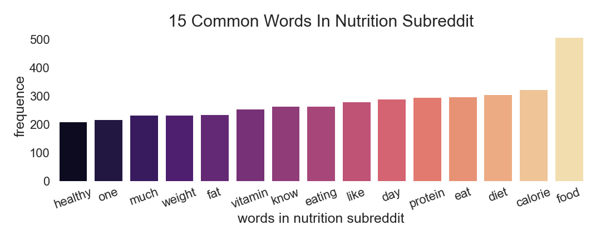
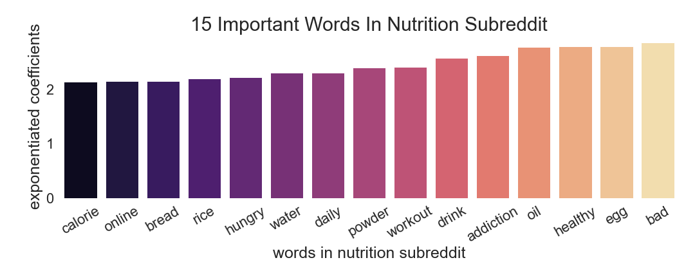
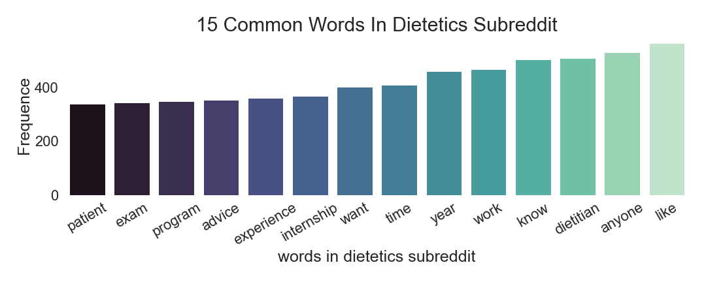
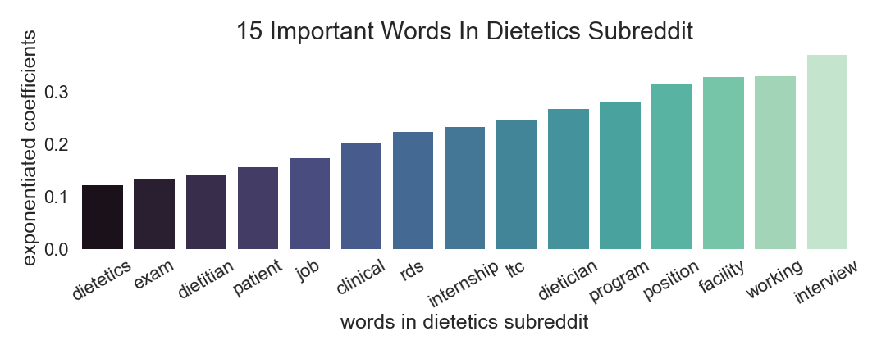

# Subreddit Web APIs & NLP

Letty Wu

    

## Executive Summary

### Background 

Reddit is one of the top 10 the most visited websites in the US, the company’s ad revenue totaled more than $100 million in 2019, in comparison, twitter generated more than 2.99 billion U.S. dollars in advertising service revenues in 2019.

### Problem Statement

Given Reddit’s substantial traffic, we can increase revenue in advertising service by using Goggle AdSense! We can use all kinds of machine learning algorithm to customizing advertising strategy for Reddit.

### Solution Demonstration

I am going to show you an example using classification model, this is only one subset of our arsenal. However we uses cookie to targeting ads, but more people incognito mode when they surf the internet, this demonstration will base on website visitors uses incognito mode or equivalent situation.

#### Dataset

The date I used here are scraped from two subreddits Nutrition and Dietetics, again, this is the information everyone has access to, if Reddit decides to use Google AdSense, we can customize an API connect to Reddit to achieve more data. 

#### Data Science Process

- Data Collection
    - Used Pushshift API to pull posts from subreddits
- Data Cleaning & EDA
    - Used text from titles and posts
    - Removed outliers
    - Used sklearn to preprocess and explore data
- Model selection 
    - Tried 13 different classifiers, and tuned hyperparameters on 3 of them
- Evaluation 
    - I used accuracy as my metric to evaluate performance on models, because we want to correctly predict each subreddits. 
    
#### Insights

    

    

From the EDA and modeling process, we found out the most common words in Nutrition subreddit includes: “food, vitamin, diet, healthy”, and one of the important words is “workout”. From those words, we can place ads that are related to food, supplements, calorie tracking apps and etc. 

    

        

Dietetics subreddit has a totally different vibe, the common & important words include: “work, internship, exams, interview, clinical”. It could be that people who visit this subreddit are either fresh graduates or thinking about switch job, so they are seeking advises or helpful information related to job hunting. In Dietetics subreddit, we can put ads like LinkedIn, resume temple editor or career related ads.  

The accuracy for the models I build are around 90%, and again, with Reddit’s internal support, we are capable to improve base on this. 

### Conclusion and Recommendations

- Google AdSense has variety of advertisements that can match words in different subreddits.
- We can automate the process using machine learning algorithms with deployment tools, and customize the strategy based on your needs to fit in Reddit culture. 
- Use Google AdSense!

[source1](https://www.businessofapps.com/data/reddit-statistics/)
[source2](https://www.wsj.com/articles/reddit-claims-52-million-daily-users-revealing-a-key-figure-for-social-media-platforms-11606822200)
[source3](https://www.semrush.com/blog/most-visited-websites/)
[source4](https://www.statista.com/statistics/274566/twitters-annual-revenue-by-channel/)

